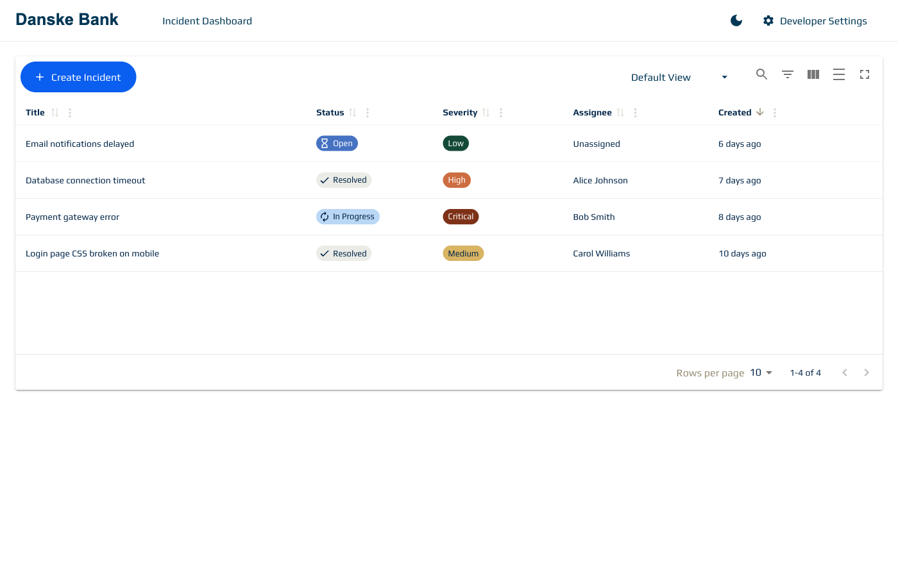
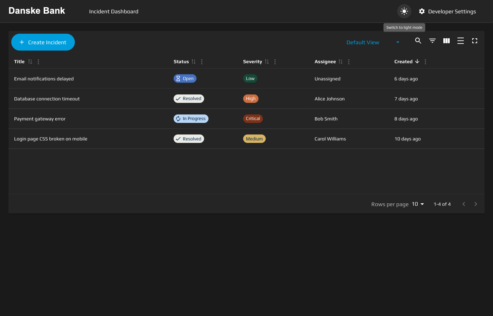
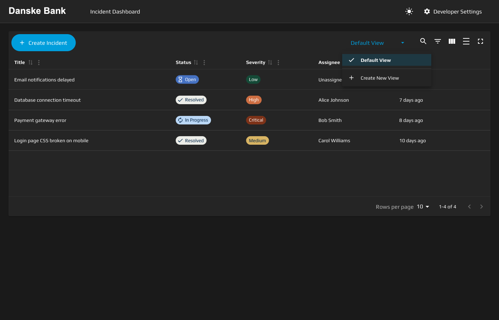
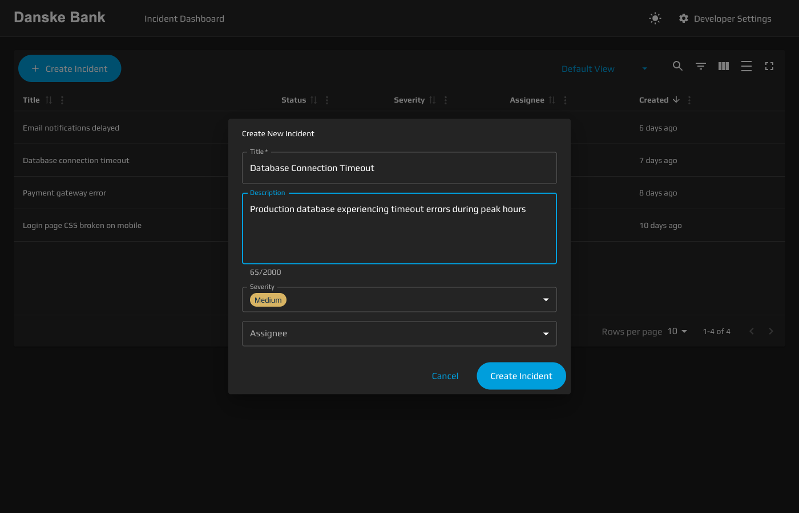
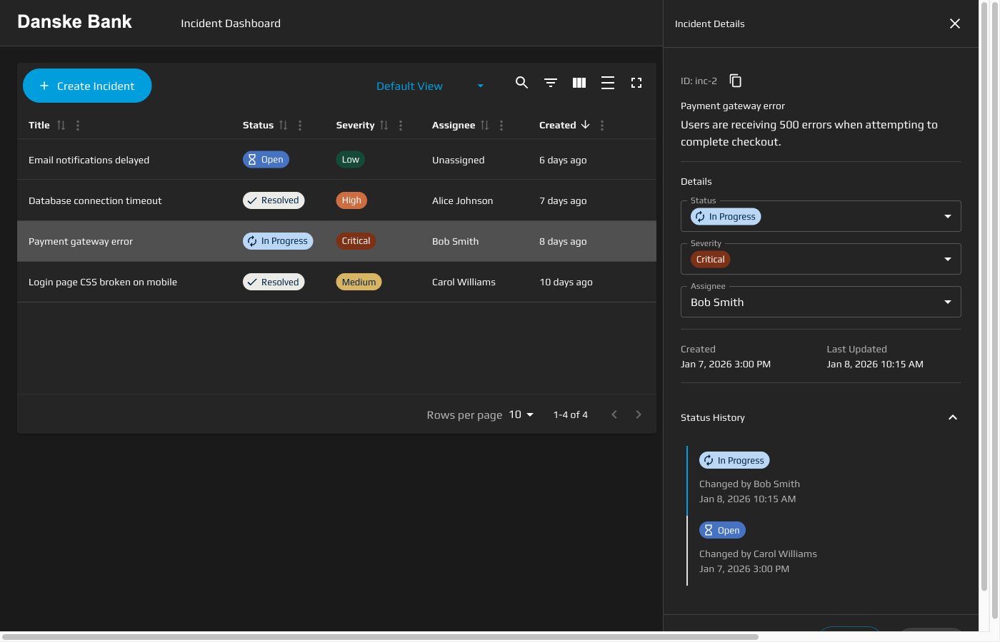
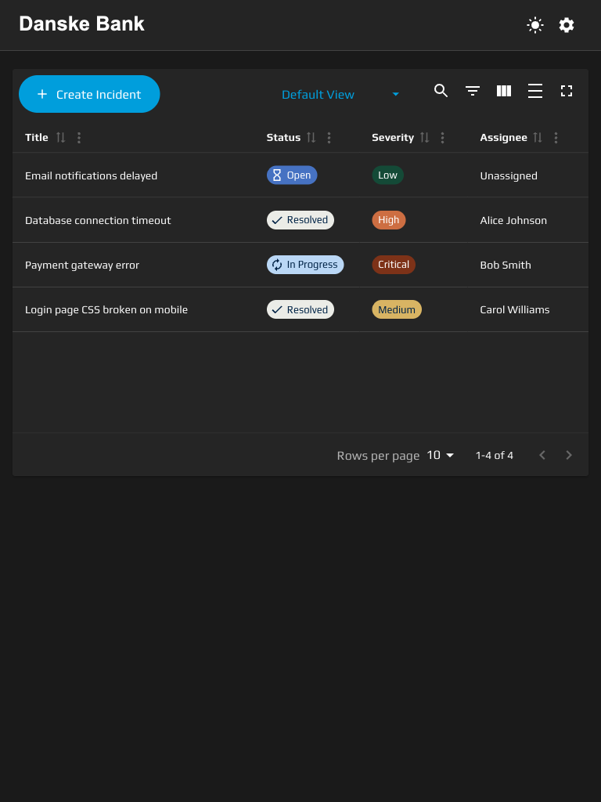
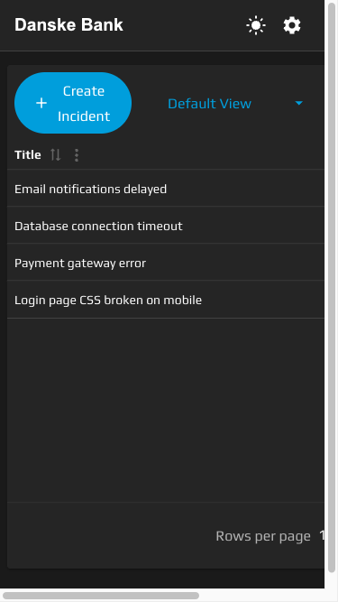

# Team Incident Dashboard - Starter Project

A minimal React + TypeScript + Vite starter project for the coding challenge.

> **Note**: This is a starter project for a coding challenge. See [candidate-brief.md](candidate-brief.md) for the full requirements and task description.

## Getting Started

### Prerequisites

- Node.js 18+
- npm or yarn

### Installation

```bash
npm install
```

### Development

```bash
npm run dev
```

Opens the app at [http://localhost:5173](http://localhost:5173)

### Testing

```bash
npm test
```

### Build

```bash
npm run build
```

### Deployment

Deploy to Vercel production:

```bash
npm run deploy
```

This command will:
1. Run all tests (must pass)
2. Run linting (must pass)
3. Build the application
4. Deploy to Vercel production URL

**First-time setup**: The first deployment will prompt for authentication and project configuration. Subsequent deployments are fully automated.

**For detailed deployment instructions**, see [specs/012-vercel-deployment/quickstart.md](specs/012-vercel-deployment/quickstart.md)

## Project Structure

```
src/
├── api/                  # Mock API with localStorage persistence
│   ├── index.ts          # API exports
│   ├── mockApi.ts        # API client with simulated delay
│   ├── seedData.ts       # Default data for incidents and users
│   ├── storage.ts        # localStorage persistence layer
│   └── types.ts          # TypeScript types
├── test/
│   └── setup.ts          # Test setup
├── App.css
├── App.test.tsx
├── App.tsx
├── index.css
├── main.tsx
└── vite-env.d.ts
```

## Features

The Team Incident Dashboard is a comprehensive incident management application with robust filtering, search, and data management capabilities. Built with modern web technologies, it provides a responsive, accessible interface for managing team incidents efficiently.

### Core Capabilities

| Category | Feature | Description |
|----------|---------|-------------|
| Data Management | Create Incident | Create new incidents with title, description, severity, and assignee |
| Data Management | Update Incident | Edit incident details including status, severity, and assignee |
| Data Management | View Incident Details | Display full incident information in side panel with status history |
| Data Management | Delete Incident | Remove incidents from the system with confirmation |
| Search & Filtering | Global Search | Full-text search across incident titles and descriptions |
| Search & Filtering | Column Filters | Filter by status, severity, assignee, and created date |
| Search & Filtering | Filter Modes | Advanced filtering with multiple operators (equals, not equals, date ranges) |
| Search & Filtering | Clear Filters | Reset all active filters and search in one click |
| Table Features | Column Sorting | Sort any column in ascending or descending order |
| Table Features | Pagination | Navigate through incidents with configurable page sizes (10, 20, 50, 100) |
| Table Features | Column Visibility | Show/hide columns via column selector |
| Table Features | Table Density | Switch between compact and comfortable viewing modes |
| Table Features | Row Selection | Click any row to open detail panel with keyboard support |
| Saved Views | Create View | Save current table configuration (filters, sorting, columns, search) |
| Saved Views | Load View | Restore previously saved table configuration |
| Saved Views | Update View | Overwrite existing view with current configuration |
| Saved Views | Rename View | Change saved view name with duplicate prevention |
| Saved Views | Delete View | Remove saved view with confirmation |
| Saved Views | Default View | Reset to application's initial state |
| UI/UX | Dark/Light Theme | Toggle between light and dark color schemes with Danske Bank branding |
| UI/UX | System Theme Detection | Automatically match user's OS theme preference |
| UI/UX | Responsive Design | Optimized layouts for mobile (320px+), tablet (768px+), and desktop |
| UI/UX | Detail Panel | Slide-out panel for viewing and editing incidents with status history |
| UI/UX | Loading States | Visual feedback with skeleton loaders and progress indicators |
| UI/UX | Empty States | Helpful guidance with contextual messages when no data exists |
| UI/UX | Error Handling | User-friendly error messages with recovery options |
| State Management | URL State Persistence | All filters, sorting, and search stored in shareable URL |
| State Management | Shareable Links | Copy URL to share exact table state with team members |
| State Management | Browser Navigation | Back/forward buttons work seamlessly with table state |

### Saved Views

**Saved Views** allow you to save your current table configuration and quickly switch between different views. When you save a view, it captures your active filters, sorting, column visibility, search query, and filter modes. This is particularly useful for common workflows like "My Open Incidents", "Critical Issues This Week", or "Unassigned Tickets". You can create unlimited views, update them as your needs change, rename them for clarity, and delete views you no longer need. The default view resets everything to the application's initial state.

## Screenshots

### Desktop Features

**Main Table View**


*The main incident dashboard with comprehensive table features including filtering, sorting, and pagination controls.*

**Dark Theme**


*Dark theme mode featuring Danske Bank's color scheme with excellent contrast and readability.*

**Saved Views**


*Saved Views feature allowing users to create, load, update, rename, and delete custom table configurations.*

**Create Incident**


*Create incident dialog with comprehensive form validation and user-friendly controls.*

**Detail Panel**


*Incident detail panel showing full incident information, edit capabilities, and status change history.*

### Responsive Design

**Tablet View**


*Responsive tablet layout (768px) with optimized column visibility and touch-friendly controls.*

**Mobile View**


*Mobile-optimized view (375px) featuring compact layout with essential information prioritized.*

## Mock API

The starter includes a mock API that intercepts `fetch()` requests to `/api/*` endpoints. Data is persisted in localStorage and survives page refreshes.

The mock API is automatically initialized in `main.tsx`.

### Available Endpoints

| Method | Endpoint             | Description            |
| ------ | -------------------- | ---------------------- |
| GET    | `/api/incidents`     | List all incidents     |
| GET    | `/api/incidents/:id` | Get incident by ID     |
| POST   | `/api/incidents`     | Create new incident    |
| PATCH  | `/api/incidents/:id` | Update incident        |
| DELETE | `/api/incidents/:id` | Delete incident        |
| GET    | `/api/users`         | List all users         |
| POST   | `/api/reset`         | Reset data to defaults |

### Usage Example

Use standard `fetch()` calls just like you would with a real REST API:

```typescript
// Fetch all incidents
const response = await fetch("/api/incidents");
const incidents = await response.json();

// Fetch a single incident
const response = await fetch("/api/incidents/inc-1");
const incident = await response.json();

// Create an incident
const response = await fetch("/api/incidents", {
  method: "POST",
  headers: { "Content-Type": "application/json" },
  body: JSON.stringify({
    title: "New issue",
    description: "Description here",
    severity: "Medium",
    assigneeId: "user-1",
  }),
});
const newIncident = await response.json();

// Update an incident
const response = await fetch("/api/incidents/inc-1", {
  method: "PATCH",
  headers: { "Content-Type": "application/json" },
  body: JSON.stringify({
    status: "In Progress",
    assigneeId: "user-2",
  }),
});
const updated = await response.json();

// Delete an incident
await fetch("/api/incidents/inc-1", { method: "DELETE" });

// Get users for assignee dropdown
const response = await fetch("/api/users");
const users = await response.json();

// Reset data to defaults
await fetch("/api/reset", { method: "POST" });
```

### Data Types

```typescript
type IncidentStatus = "Open" | "In Progress" | "Resolved";
type IncidentSeverity = "Low" | "Medium" | "High" | "Critical";

interface Incident {
  id: string;
  title: string;
  description: string;
  status: IncidentStatus;
  severity: IncidentSeverity;
  assigneeId: string | null;
  createdAt: string;
  updatedAt: string;
  statusHistory: StatusHistoryEntry[];
}

interface User {
  id: string;
  name: string;
  email: string;
}
```

## Stack

- **React 18** - UI library
- **TypeScript** - Type safety
- **Vite** - Build tool
- **Vitest** - Testing
- **React Testing Library** - Component testing

## Development Process

This project was developed using AI-assisted development with **[SpecKit](https://speckit.app/)**, a systematic approach to building software features through structured specification, planning, and implementation phases.

### SpecKit Workflow

Each feature in this project follows a rigorous development process:

1. **Specification Phase** - Clear, testable requirements without implementation details
2. **Planning Phase** - Technical design, architecture decisions, and file structure
3. **Implementation Phase** - Automated task execution with comprehensive testing
4. **Validation Phase** - Quality checks against success criteria

All feature specifications, plans, and implementation tasks are documented in the `/specs` directory, providing full traceability from requirements to implementation.

### AI Tools Used

- **Claude Sonnet 4.5** - Primary development assistant via Claude Code CLI
- **SpecKit Framework** - Structured development methodology
- **Playwright** - Automated screenshot capture and browser testing

This approach ensures consistent code quality, comprehensive documentation, and systematic feature delivery.
